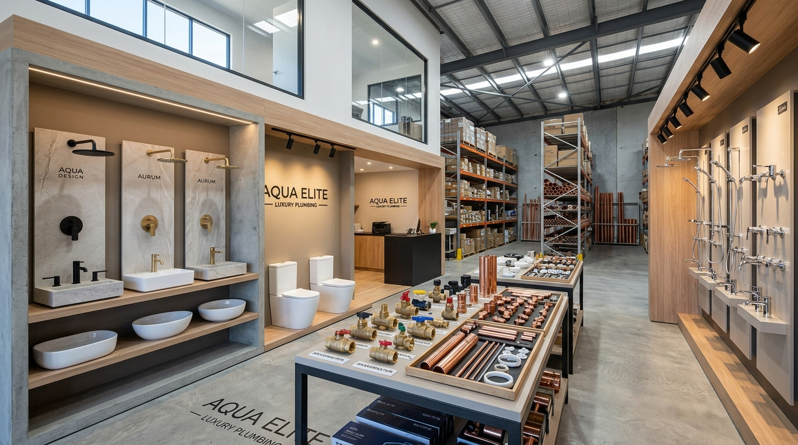

# AQUAPRO — World-Class Plumbing Supplies & Sanitary Fittings Store HTML Template

A modern, high-conversion, production-ready website designed for commercial plumbing suppliers, mechanical (MEP) contractors, and retail architectural sanitary ware stores.



---

## 🌟 Key Features

- **11 Production-Ready HTML Pages:**
  1. `index.html` — Commercial & Contractor Showroom (Home 1) — **EXACTLY 7 Sections**
  2. `index-2.html` — Architectural Editorial Catalog (Home 2) — **EXACTLY 7 Sections**
  3. `shop.html` — Interactive Product Catalog with faceted filters — **EXACTLY 5 Sections**
  4. `categories.html` — Product Categories & MEP Bill of Materials Generator — **EXACTLY 5 Sections**
  5. `product-details.html` — Product Specs, 3D CAD/BIM Downloads & Bulk Schedule — **EXACTLY 5 Sections**
  6. `brands.html` — Authorized Partner Brand Directory & A-Z Filter — **EXACTLY 5 Sections**
  7. `about.html` — 25 Years of Engineering Heritage & Quality Assurance — **EXACTLY 5 Sections**
  8. `bulk-pricing.html` — Contractor Volume Pricing & RFQ Request Form — **EXACTLY 5 Sections**
  9. `contact.html` — Showroom Locations, Warehouse Logistics & Contact Form — **EXACTLY 5 Sections**
  10. `404.html` — 404 Disconnected Line Page with instant search — **EXACTLY 5 Sections**
  11. `coming-soon.html` — 2026 Digital Contractor Portal with live countdown — **EXACTLY 5 Sections**

- **Interactive RFQ (Request for Quote) Drawer:**
  - Contractors can accumulate multi-item product packages and request single-click trade quotations.
- **Dynamic Live Product Filters:**
  - Category, Brand, Price Slider, Availability, and real-time keyword search.
- **Product Quick View Modal:**
  - Instant specification inspect, dimensional drawing preview, and direct RFQ addition.
- **Interactive Project-Based Product Finder:**
  - Select building type (Residential, Commercial, Hospital, Hotel) to generate a custom MEP bill of materials.
- **Dark / Light Mode & RTL Support:**
  - Automatic system preference detection, persistent localStorage, and dedicated `rtl.css` for Arabic and Hebrew layouts.
- **Zero External Dependencies:**
  - 100% pure modular Vanilla ES6+ JavaScript and clean CSS custom properties.
- **Accessibility & SEO:**
  - WCAG 2.1 AA compliant, semantic HTML5, JSON-LD Schema markup, `sitemap.xml`, and `robots.txt`.

---

## 📁 Directory Structure

```text
Plumbing_Supplies_Sanitary_Fittings_Store/
├── index.html                  # Home 1 (7 Sections)
├── index-2.html                # Home 2 (7 Sections)
├── shop.html                   # Shop Catalog & Filters (5 Sections)
├── categories.html             # Categories & MEP Finder (5 Sections)
├── product-details.html        # Product Info & Technical Data (5 Sections)
├── brands.html                 # Brand Directory & Showcases (5 Sections)
├── about.html                  # About Us & Quality Story (5 Sections)
├── bulk-pricing.html           # Contractor Wholesale RFQ (5 Sections)
├── contact.html                # Store Contact & Interactive Map (5 Sections)
├── 404.html                    # 404 Error Page (5 Sections)
├── coming-soon.html            # 2026 Portal Beta (5 Sections)
├── robots.txt                  # SEO robots configuration
├── sitemap.xml                 # XML sitemap
├── README.md                   # This file
├── documentation/
│   └── index.html              # Template developer documentation
└── assets/
    ├── css/
    │   ├── style.css           # Core design tokens, layout & components
    │   ├── dark-mode.css       # Dark mode theme overrides
    │   └── rtl.css             # Right-to-left layout rules
    ├── js/
    │   └── main.js             # Modular Vanilla ES6+ engine
    └── images/
        ├── hero-showroom.jpg
        ├── hero-contractor.jpg
        ├── sanitary-bath.jpg
        ├── valves-pipes.jpg
        ├── categories/         # Vector category SVGs
        ├── products/           # Realistic product SVGs & specs
        └── brands/             # Partner brand vector logos
```

---

## 🚀 How to Run Locally

Open any of the `.html` files directly in your web browser (e.g. Chrome, Firefox, Safari, Edge), or serve via any static HTTP server:

```bash
# Python 3
python -m http.server 8000

# or Node.js (npx)
npx serve .
```

Navigate to `http://localhost:8000/` in your browser.

---

## 📄 License & Credits

- **Design & Code:** AQUAPRO Engineering Design System
- **Fonts:** Google Fonts (`Plus Jakarta Sans`, `Outfit`, `Inter`, `JetBrains Mono`)
- **Icons & Graphics:** Custom crafted SVG assets
